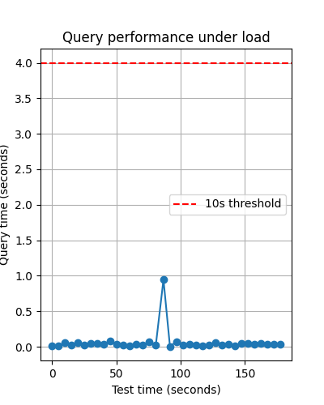
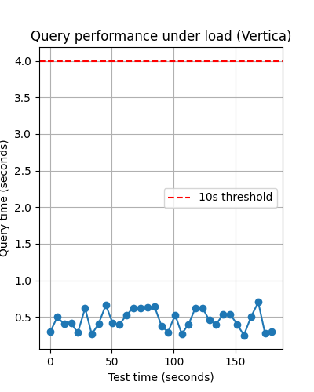

# Исследование распределенных хранилищ

## Результаты нагрузочного тестирования
### Clickhouse
Для теста было загружено **10 000 000** записей в несколько потоков

* Insert Performance: **101 131.71** records/second
* Simple SELECT: **0.0037** seconds
* Aggregation Query: **0.0072** seconds
* JOIN Query: **0.1766** seconds
* Complex Analytics Query: **0.3743** seconds
* Average Query Time Under Load: **0.0608** seconds
* Maximum Query Time Under Load: **0.9458** seconds

### Vertica
Для теста было загружено **3 000 000** записей, меньше почти в 3 раза из-за ограничений docker образа (нельзя фактически распределить нагрузку, т.к версия для сообщества)

* Insert Performance: **45 894.59** records/second
* Simple SELECT: **0.0281** seconds
* Aggregation Query: **0.0581** seconds
* JOIN Query: **0.7747** seconds
* Complex Analytics Query: **0.8063** seconds
* Average Query Time Under Load: **0.4592** seconds
* Maximum Query Time Under Load: **0.7004** seconds 

### Итог
По итогу в данном тесте более производительным оказался Clickhouse, однако, Verticа работала фактически на одной ноде